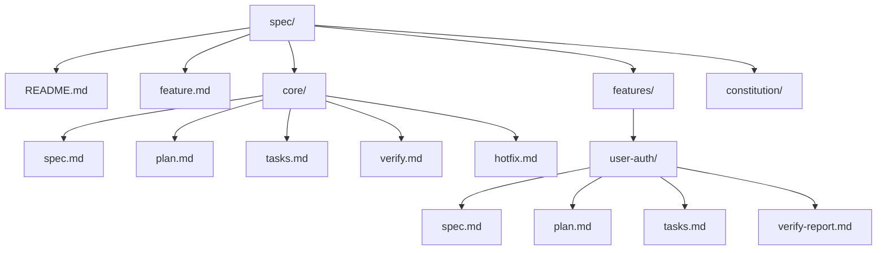
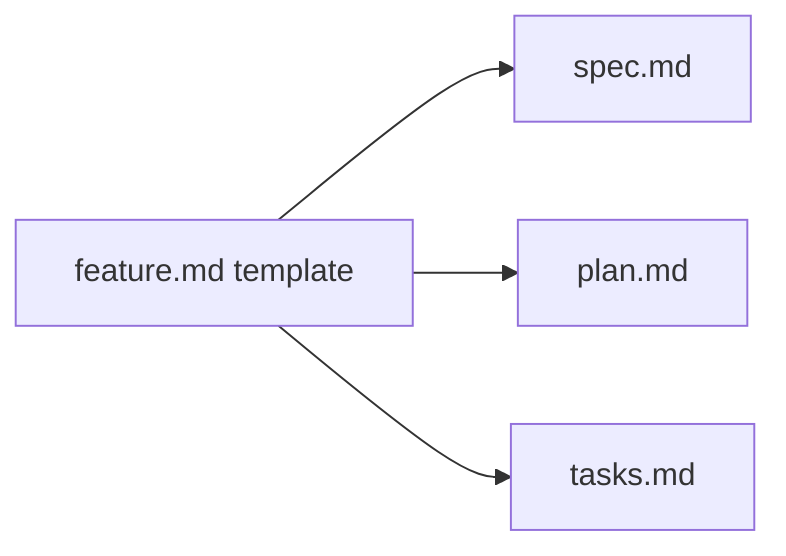
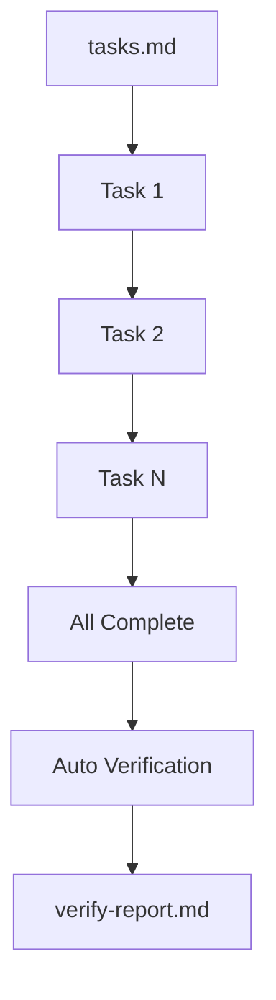

> **⚠️ ALPHA VERSION** - This is an early release. Features may change and some functionality may be incomplete.

# 🚀 Spec Feature

**Turn your idea into a ready development plan in minutes!**

Create technical specifications, plans, and tasks for your development team using AI from a single description.

## 🎯 Benefits

✨ Clear project start • 🤝 Fewer misunderstandings • 📚 Documented architecture • ✅ Controlled tasks • 🔄 Easy updates • 🤖 Better AI integration

## ⚡ Quick Start

```bash
# Initialize in current directory
npx spec-feature init

# Or with custom folder name
npx spec-feature init my-project-docs
```

Creates the Spec Feature structure inside `spec/` by default, or inside the folder name you provide.

### View specs in browser

```bash
# Start viewer (default folder: spec)
npx spec-feature view

# Start viewer for a specific feature and/or custom folder
npx spec-feature view <feature-slug> --folder my-docs
```

- Opens a local web viewer at `http://localhost:4173/`.
- If `<feature-slug>` exists under `spec/features/`, the viewer jumps directly to it; otherwise you land on the feature list.
- Pass `--folder|-f` when your specs live outside the default `spec/` directory.

## 📁 Structure



**Templates** (core/) → **Features** (features/)

## 🧭 Constitution

- `spec/constitution/` stores project rules and constraints for humans and AI.
- Before changes, read `spec/constitution/README.md` and all files in the folder.
- Conflict order: Constitution > feature specs > plans > tasks.
- Add or update Constitution documents when a new invariant requirement appears.

## 🎬 Workflow

**Send these prompts to your AI assistant** (Claude, Cursor, Copilot, etc.) to create, execute, and update features.

### 1️⃣ Create Feature

```
Use the template from spec/feature.md.
#feature-name# Your description here
```

Format: `#feature# description` → creates `spec/features/feature-name/` with 3 files:



### 2️⃣ Execute Tasks

```
Execute all tasks in spec/features/{FEATURE}/tasks.md
```



### 3️⃣ Update Feature

```
Use the template from spec/feature.md.
#feature-name# New requirements
```

Overwrites spec.md, plan.md, tasks.md with updated content.

## 🛠️ Troubleshooting

| Problem | Solution |
|---------|----------|
| No feature folder created | Check format `#feature# context` |
| Wrong task order | Reorder numbers in tasks.md |
| Verification not launched | All tasks must be checked, or run manually: `Use template from spec/core/verify.md to verify spec/features/{FEATURE}/` |
| Update conflicts | Use git to track changes |
